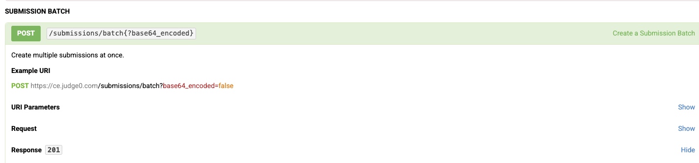

Judge0 Installation Guide


# Install Homebrew (if not already installed)

/bin/bash -c "$(curl -fsSL https://raw.githubusercontent.com/Homebrew/install/HEAD/install.sh)"

# Install Docker using Homebrew

brew install --cask docker

# Launch Docker Desktop

open /Applications/Docker.app

# Verify Docker installation

docker --version

# Verify Docker Compose installation

docker-compose --version


## **Step 2: Install Docker and Docker Compose**

1. **Install Docker**  
   - Open the **Ubuntu terminal** and run:
     ```bash
     sudo apt update && sudo apt install -y docker.io
     ```
   - (Note: It's better to install `docker.io` package for Ubuntu.)

2. **Install Docker Compose**  
   - Still in the Ubuntu terminal, install Docker Compose:
     ```bash
     sudo apt install -y docker-compose
     ```

---

## **Step 3: Install and Set Up Judge0**

1. **Download and Extract Judge0**  
   - Download the Judge0 release archive:
     ```bash
     wget https://github.com/judge0/judge0/releases/download/v1.13.1/judge0-v1.13.1.zip
     ```
   - Unzip the downloaded archive:
     ```bash
     unzip judge0-v1.13.1.zip
     ```

2. **Set Up Secure Passwords**  
   - **Generate random passwords** for Redis and Postgres:
     - Visit [Random Password Generator](https://www.random.org/passwords/?num=1&len=32&format=plain&rnd=new) and copy the first password.
     - Open the `judge0.conf` file:
       ```bash
       nano judge0-v1.13.1/.env
       ```
     - Update the `REDIS_PASSWORD` with the generated password.
     - Repeat the process for `POSTGRES_PASSWORD` using a new random password.

3. **Start Judge0 Services**  
   - Navigate to the Judge0 folder:
     ```bash
     cd judge0-v1.13.1
     ```
   - Start the database and Redis services:
     ```bash
     docker-compose up -d db redis
     ```
   - Wait for a few seconds:
     ```bash
     sleep 10s
     ```
   - Start the remaining services:
     ```bash
     docker-compose up -d
     ```
   - Wait a few more seconds:
     ```bash
     sleep 5s
     ```

4. **Verify the Installation**  
   - Open your browser and visit:
     ```
     http://localhost:2358/docs
     ```
   - You should see the Judge0 API documentation page, meaning your Judge0 instance is running successfully!


## Create Problem Controller

We are using Judge0 Api to test our submission with each test cases and language.

We are providing the solution and checking if each solution is giving desired output or not

We use 2 end points of Juge0 

1. Create submissions which return tokens 
2. Get submissions if it is successfull
